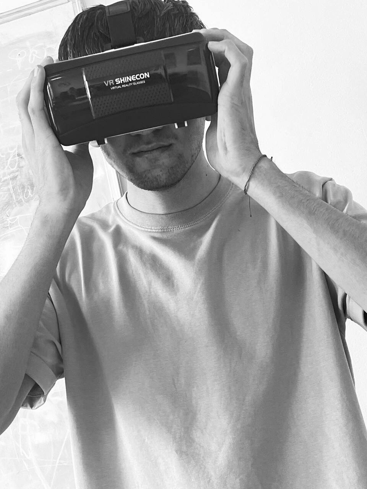
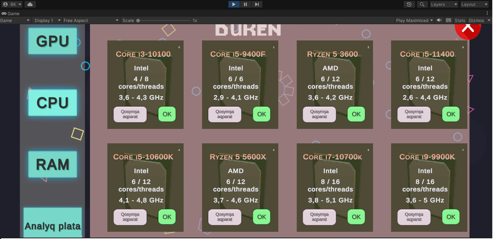
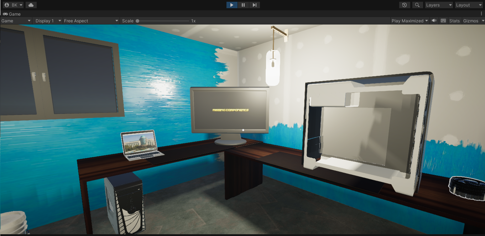
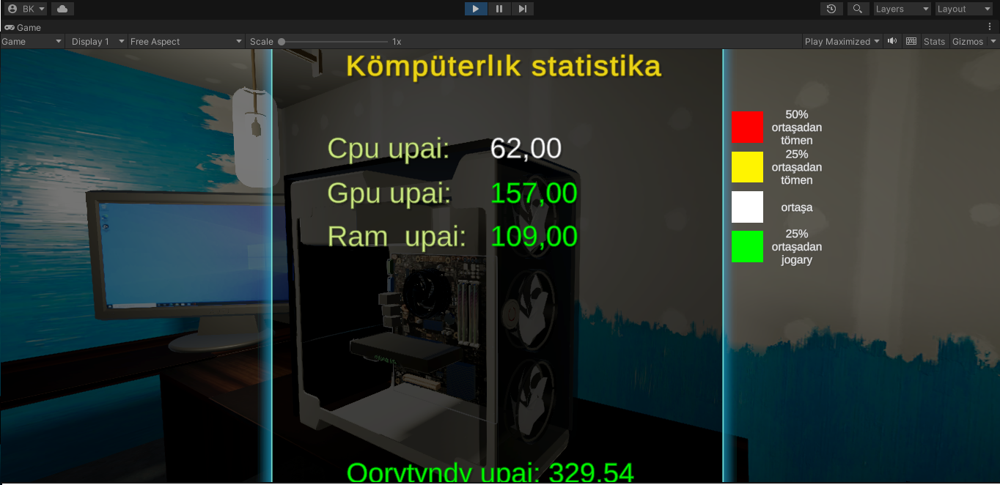

# VR PC Builder

>**Developing a PC assembly application through VR Virtual Reality** 
>**Разработка приложения для сборки ПК через VR Виртуальной Реальности**
 
> *(Unity-based Virtual Reality project)*

| | |
|---|---|
| |  |

---

##  About the Project
This is a VR application created in Unity, in which the player can assemble a personal computer in an interactive virtual room using gestures and VR glasses. The player enters a room where there is an empty system unit and a laptop. Through the laptop interface, the player can order PC components such as processor, graphics card, RAM, power supply and other components by examining their characteristics. After ordering, the components appear on the table, and the player uses VR controllers to manually insert the parts into the PC case. When the build is completed, the PC turns on  this means the successful completion of the game.


---

##  Key Features
- Realistic VR interaction moving around the room, interacting with objects with your hands Capture, rotate and place details using the natural gestures of the controller.
- In the gaming environment, browse the components through the component store, compare the specifications, and then make a purchase with one click.
- Detailed information about each element (CPU, RAM, GPU). Assembly logic only compatible components are suitable; incorrect placement is blocked.
- Physical assembly of the computer: take —insert — plug.
- The computer turns on with the fan turning on after the PC is successfully assembled.

---

##  Screenshots
| Ordering Components | Assembling the Build | Finished PC |
|---------------------|----------------------|-------------|
|  |  |  |

> Screenshots from the game

---

## 🛠 Technologies and tools
| Layer | Technology |
|-------|------------|
| **Engine** | Unity **2020.3 LTS** (or newer) |
| **XR** | Unity XR Interaction Toolkit • OpenXR |
| **Language** | C# |
| **Version Control** | SteamVR / OpenXR |
| **Platform** | Support for VR devices (for example Oculus Rift, Meta Quest, HTC Vive) |

---

##  System requirements
- VR-Ready PC (NVIDIA GTX 1060 / AMD RX 480 or better)
- 8 GB RAM (16 GB recommended)
- VR Headset + Controllers (Oculus/Meta, Vive, Valve Index, etc.)

---

##  How to launch
### 1. Clone the Repository
```bash
# SSH
git clone git@github.com:<your_username>/PC-Building-Vr.git
# or HTTPS
git clone https://github.com/<your_username>/PC-Building-Vr.git
```

### 2. Open in Unity Hub
1. **Add** the project folder you just cloned.
2. Select the Unity version specified above (install via Hub if missing).
3. Open the project.

### 3. Install Unity Packages
- Go to **Window ▸ Package Manager**, enable *XR Plug-in Management* and *XR Interaction Toolkit*.
- Activate **OpenXR** (Project Settings ▸ XR Plug-in Management).

### 4. Play in Editor
1. Connect your VR headset.
2. Open **Scenes/GameRoom.unity**.
3. Hit **Play**.

### 5. Build a Stand-alone Player *(optional)*
```
File ▸ Build Settings ▸ PC, Mac & Linux Standalone ▸ Windows ▸ Build
```

---

##  Controls
| Action | VR Input |
|--------|----------|
| Grab component | *Grip* button |
| Release / Place | Release *Grip* |
| Rotate held item |  use *Joystick* |
| Teleport | Press and hold the *Joystick* in front of you, aim at the desired area of the system unit, and hold the button for a few seconds until the component is automatically inserted into the system unit |
| Open Store / Close | *A / X* button |

> Controls are mapped via the **XR Interaction Toolkit** input actions. See `Assets/Input/PlayerInputActions.inputactions` to remap.

---

## 📂 Project Structure (high-level)
```
Assets/
 ├─ Animations/       # Animations of models and UI
 ├─ Downloaded/       # Third party assets downloaded from the asset Store
 ├─ ExampleAssets/    # Examples and demo content
 ├─ Gradients/        # Gradients for UI and materials
 ├─ LeanTween/        # LeanTween plugin (animations/tweeds)
 ├─ Materials/        # All PBR materials and shaders
 ├─ Presets/          # Unity presets for quick customization of objects
 ├─ QuickOutline/     # Scripts and materials for the stroke effect
 ├─ Resources/        # Resources loaded in runtime (resources.Load)
 ├─ SavedScores/      # Saved results/progress files
 ├─ Scenes/           # Unity scenes (GameRoom, Store)
 ├─ Scripts/          # C#-gameplay and logic scripts
 ├─ Settings/         # ScriptableObject-configs and other settings
 ├─ Sounds/           # Audio clips (SFX, music, UI)
 ├─ TextMesh Pro/     # TextMesh pro package and fonts
 ├─ TutorialInfo/     # Tutorial files (if there is a learning mode)
 └─ XR/               # XR Interaction Toolkit and related assets
Packages/             # Manifest.json and unity package manager packages           
```

---

##  Author
**Beksultan Kochkombaev** – <bkochkombaev@gmail.com>  

> *Made with  in Unity.*
